# ISDREM / IDRMC — Complete Technical Defense Guide

**Integrated Information System for Disaster Response and Emergency Management (ISDREM)**  
Built for the **Ethiopian Disaster Risk Management Commission (EDRMC)**  
Industrial project (Phase I & II), School of Information Science, Addis Ababa University

This guide synthesizes:

- `idrmdbkd` (NestJS API)
- `idrmc-frontend` (Next.js web consoles)
- `idrmc-mobile` (Expo React Native field app)
- Phase I & II Word documents + `idrmc-frontend/documet/parsed.txt`

---

## Mental model (30 seconds)

Think of ISDREM as a **three-tier disaster operations platform**:

1. **Citizens / field agents (mobile)** report geo-tagged incidents with photos.
2. **Incident validators (web `/incval`)** verify and escalate incidents.
3. **Disaster managers (`/disastermanager`)** declare disasters, run alerts, donations, resource needs.
4. **ERT command (`/ert`)** tracks teams and inventory on a map (backend ready; web mostly mock).
5. **One API + PostGIS database** holds truth; clients are thin.

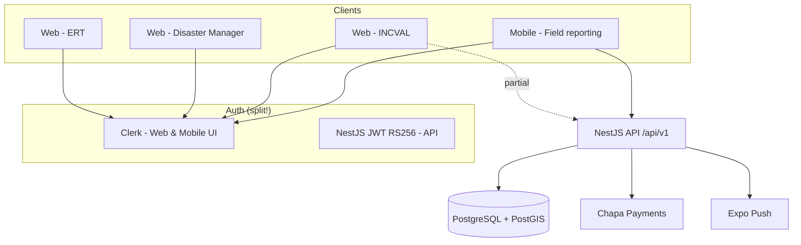

---

# PART A — ARCHITECTURE LAYERS

## 1. High-level system architecture

| Layer | Technology | Responsibility |
|-------|------------|----------------|
| **Presentation** | Next.js 16 + React 19 (web), Expo 54 + RN 0.81 (mobile) | Role-based UIs, forms, dashboards |
| **Identity (UI)** | Clerk | Sign-in, session, route guards |
| **Application API** | NestJS 10, REST `/api/v1` | Business rules, validation, Swagger |
| **Identity (API)** | Passport JWT RS256 + Local | Login/register/refresh (parallel to Clerk) |
| **Persistence** | TypeORM + PostgreSQL + PostGIS | Relational + spatial queries |
| **Payments** | Chapa | Donation checkout + webhooks |
| **Push** | Expo Server SDK | Mobile broadcast |
| **Files** | Local `./uploads` | Image attachments |
| **Hosting (as deployed)** | Render (API), Vercel (web implied), EAS (mobile) | Cloud |

**Bounded contexts (documented in Phase II, partially reflected in code):**

| Context | Backend module | Primary actors |
|---------|----------------|----------------|
| Incident Management | `incident` | Public, validators |
| Early Warning & Alerting | `notification` (+ frontend alerts UI) | Disaster manager |
| Resource & Logistics | `resources`, `location` | Logistics, ERT |
| Donor & Humanitarian | `donation`, `comment` | Public, managers |
| ERT Operations | `ert` | ERT command |
| Identity & Admin | `auth`, `user` | Admin |

---

## 2. Low-level architecture

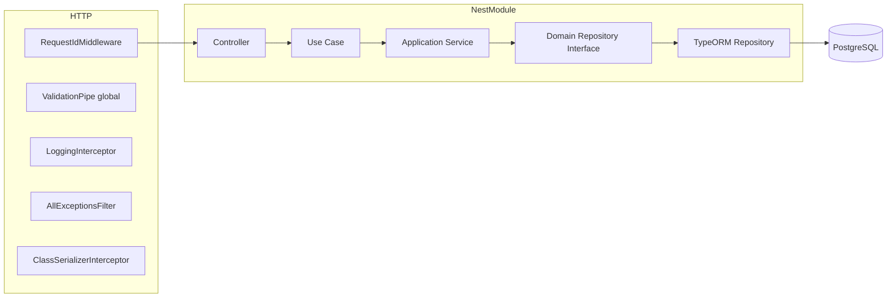

**Bootstrap** (`idrmdbkd/src/main.ts`):

- Global prefix: `api/v1`
- CORS enabled (wide open)
- Static files: `/uploads`
- Swagger: `/swagger`
- Port from config (default 3000)

---

## 3. Component architecture

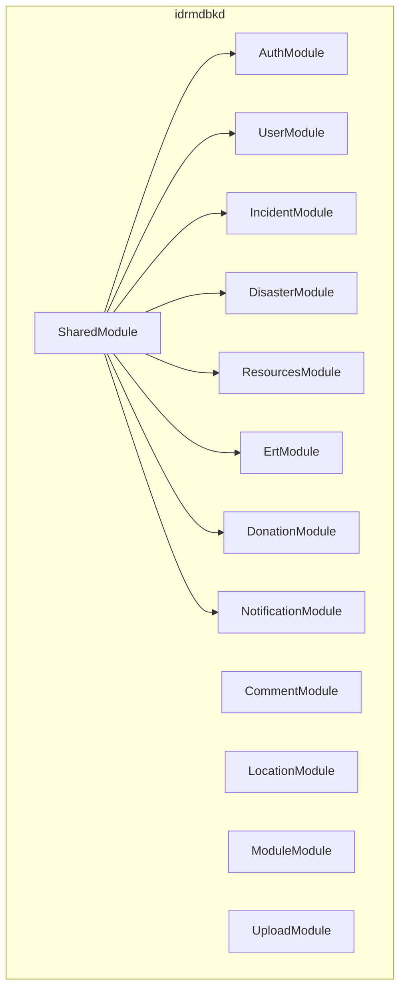

Each DDD-style module follows:

```
domain/entities + domain/repositories (ports)
application/use-cases + application/services + dto
infrastructure/persistence/typeorm + repositories (adapters)
interfaces/http/controllers
```

**Exceptions (classic 3-tier):** `auth`, `user`, `upload`

---

## 4. Backend architecture (idrmdbkd)

**Registered modules** (`app.module.ts`):

```typescript
@Module({
  imports: [
    SharedModule,
    UserModule,
    AuthModule,
    ModuleModule,
    IncidentModule,
    DisasterModule,
    LocationModule,
    DonationModule,
    NotificationModule,
    CommentModule,
    UploadModule,
    ResourcesModule,
    ErtModule,
  ],
  controllers: [AppController],
  providers: [AppService],
})
export class AppModule {}
```

**Design patterns in use:**

- Repository pattern (domain port + TypeORM adapter)
- Use case / application service orchestration
- Rich domain entities (donation state machine)
- Strategy pattern (Passport JWT/local/refresh)
- ACL service for users (`BaseAclService` + `UserAclService`)
- Idempotency keys for donations
- PostGIS spatial queries in raw SQL

**Not wired despite dependency:** `@nestjs/cqrs` — `Module` entity extends `AggregateRoot` but no event bus/handlers.

**Critical security gap:** Most domain controllers lack `@UseGuards(JwtAuthGuard)` — incidents, disasters, resources, ERT are effectively **open APIs**.

---

## 5. Frontend architecture (idrmc-frontend)

| Concern | Choice |
|---------|--------|
| Framework | Next.js 16 App Router |
| UI | shadcn/ui + Radix + Tailwind v4 |
| Auth | Clerk (`clerkMiddleware` in `src/proxy.ts`) |
| Server state | TanStack Query v5 |
| Client state | Zustand (notifications, template leftovers) |
| API | `fetchClient` → `NEXT_PUBLIC_API_URL` (default `http://localhost:3000/api/v1`) |

**Three persona consoles** (route group `(igmr)`):

| Role (Clerk metadata) | Base path | Purpose |
|----------------------|-----------|---------|
| `incident_validator` | `/incval/*` | Verify incidents, dashboards |
| `disaster_response_team` | `/disastermanager/*` | Disasters, alerts, reports |
| `emergency_response_team` | `/ert/*` | Team, medical inventory, map |
| `admin` | All above | Super access |

**Maturity:** API hooks exist for incidents, disasters, donations, locations, comments — but **disaster manager and ERT pages still use mock data**; donations have **no UI routes**.

---

## 6. Mobile architecture (idrmc-mobile)

| Concern | Choice |
|---------|--------|
| Framework | Expo 54 + React Native 0.81 |
| Routing | Expo Router (file-based) |
| Auth | Clerk (`@clerk/expo`) |
| Data | TanStack Query + Axios |
| Styling | NativeWind v5 |
| Maps | react-native-maps + Nominatim geocoding |

**Implemented flows:**

- Field incident report: GPS → photo upload → `POST /api/v1/incidents`
- Browse incidents/disasters (read)
- Mock notifications, mock disaster comments/donations

**Not implemented:** ERT, real push, offline sync, API Bearer tokens (Clerk JWT never sent to backend).

---

## 7. Database architecture & ERD

**Engine:** PostgreSQL 16 + PostGIS 3.4 (`postgis/postgis:16-3.4` in Docker)

**Schema management:** `synchronize: true` + migrations (risky for production)

### Conceptual ERD

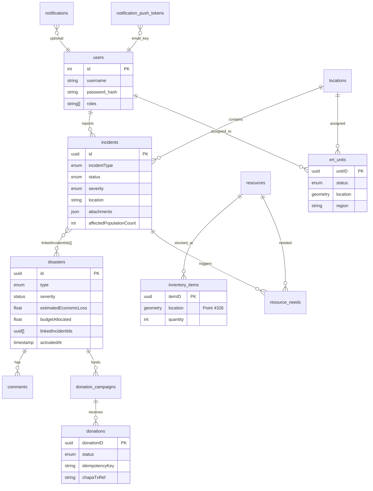

**Spatial columns:** `inventory_items.location`, `ert_units.location` — queried with `ST_DWithin`, `ST_Distance`.

**Documented but missing in code:** `audit_logs` table/entity (Phase II class description exists; no `src/audit` module).

**Legacy:** `articles` migration + skipped e2e — no module.

---

## 8. API architecture & communication flow

**Convention:** REST JSON, envelope `{ data, meta? }`, global validation, Bearer auth where guarded.

### Domain endpoint map (abbreviated)

| Domain | Prefix | Key operations |
|--------|--------|----------------|
| Auth | `/auth` | login, register, refresh-token |
| Users | `/users` | me (JWT), list (JWT+roles), id (open!) |
| Incidents | `/incidents` | CRUD, resolve |
| Disasters | `/disasters` | CRUD, `POST /from/:incidentId` |
| Locations | `/locations` | CRUD |
| Comments | `/comments` | CRUD, by disaster |
| Donations | `/donations` | campaigns, initialize, Chapa webhook, receipt PDF |
| Notifications | `/notifications` | CRUD, broadcast, push-token |
| Resources | `/resources`, `/inventory`, `/needs` | GIS allocation |
| ERT | `/ert`, `/ert-map` | CRUD, nearby (note: docs say `/ert/map`, code uses `/ert-map`) |
| Uploads | `/uploads` | multipart image |

### Request lifecycle

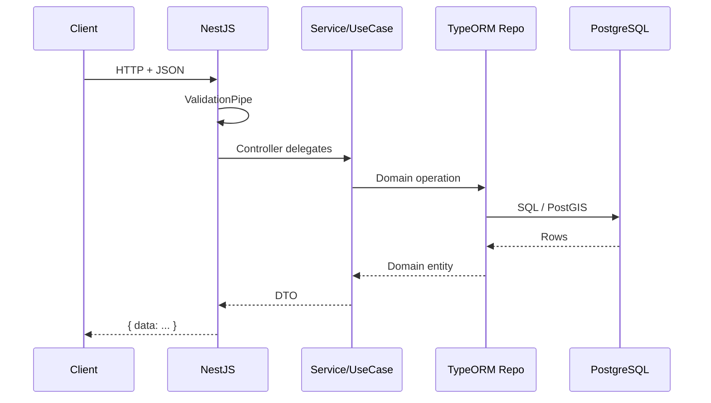

---

## 9. Authentication & authorization flow

### Two parallel auth systems (defense-critical)

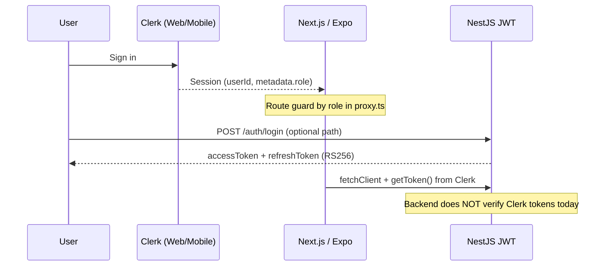

| Mechanism | Where | Notes |
|-----------|-------|-------|
| **Clerk** | Frontend + mobile UI | `publicMetadata.role` → `incident_validator`, etc. |
| **NestJS JWT** | API `auth` module | RS256 keys in env; roles `USER`, `ADMIN` only |
| **ACL** | `UserAclService` | ADMIN manage all; USER read all, update self |
| **Route guards** | `proxy.ts` | Prefix-based RBAC for web routes |

**Gaps:**

- Clerk roles ≠ backend `ROLE` enum
- Mobile never sends `Authorization` header
- Domain APIs mostly unauthenticated
- `GET/PATCH /users/:id` unguarded

---

## 10. Deployment architecture

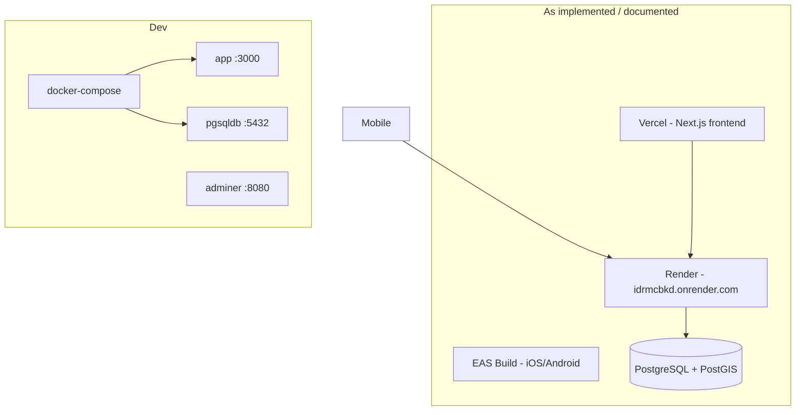

| Artifact | Target |
|----------|--------|
| API | Docker / Render |
| Web | Vercel (per Phase I scope) |
| Mobile | EAS (`eas.json`: dev/preview/production) |
| DB | PostGIS Docker locally; managed Postgres in cloud |

**CI:** GitHub Actions — build, tests, SonarQube (`idrmdbkd/.github/workflows/`)

---

## 11. Network & infrastructure design

| Path | Protocol | Port |
|------|----------|------|
| Client → API | HTTPS REST | 443 (Render) |
| API → Postgres | TCP | 5432 |
| API → Chapa | HTTPS | external |
| API → Expo push | HTTPS | external |
| Client → Nominatim | HTTPS | geocoding (mobile) |
| Static uploads | HTTP `/uploads` | same host as API |

**No:** API gateway, WAF, Redis, message queue, WebSockets (listed as future in GIS docs).

---

# PART B — UML & FLOW DIAGRAMS

## 12. Sequence: Submit incident (mobile → API)

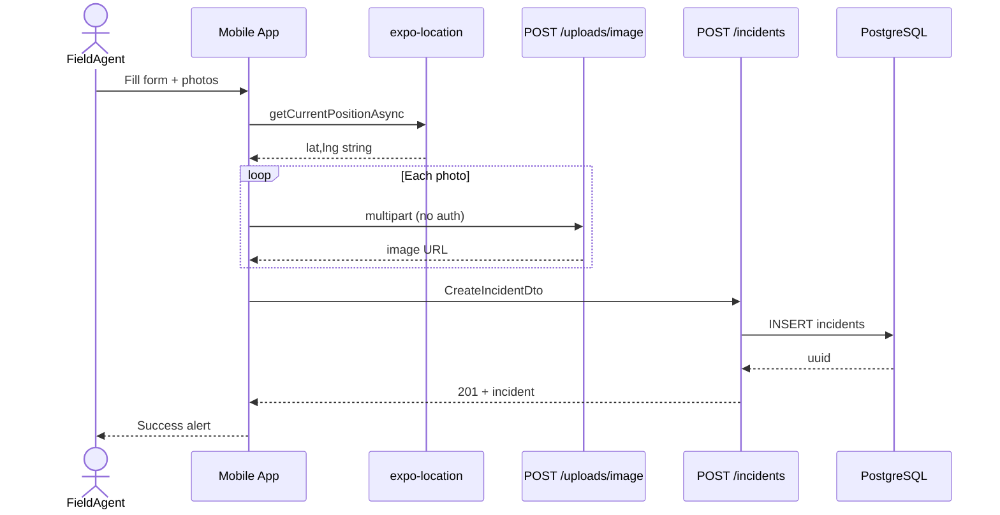

## 13. Sequence: Incident → disaster escalation

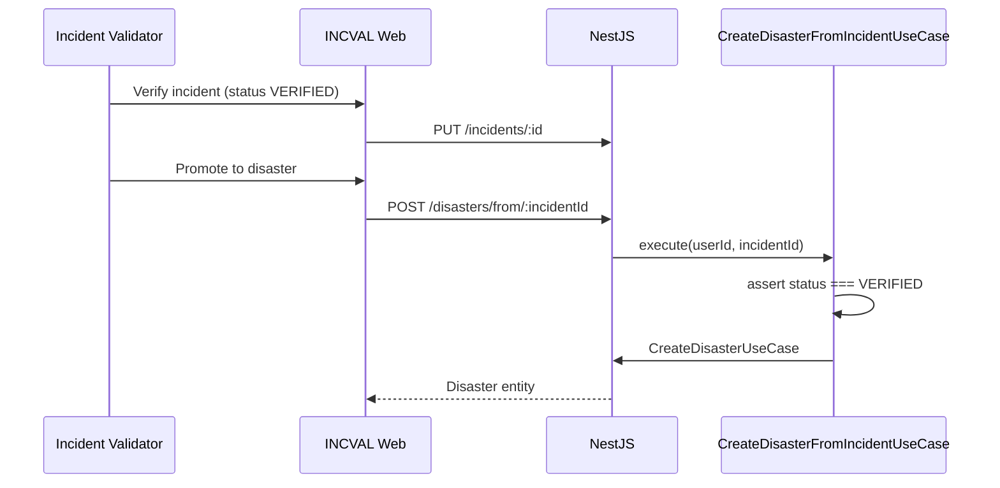

**Code note:** Error message says "resolved first" but check is `VERIFIED` — inconsistency to know for defense.

## 14. Sequence: Donation via Chapa

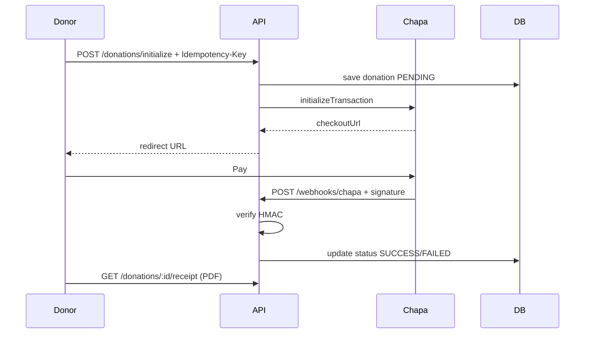

## 15. Activity: Incident lifecycle

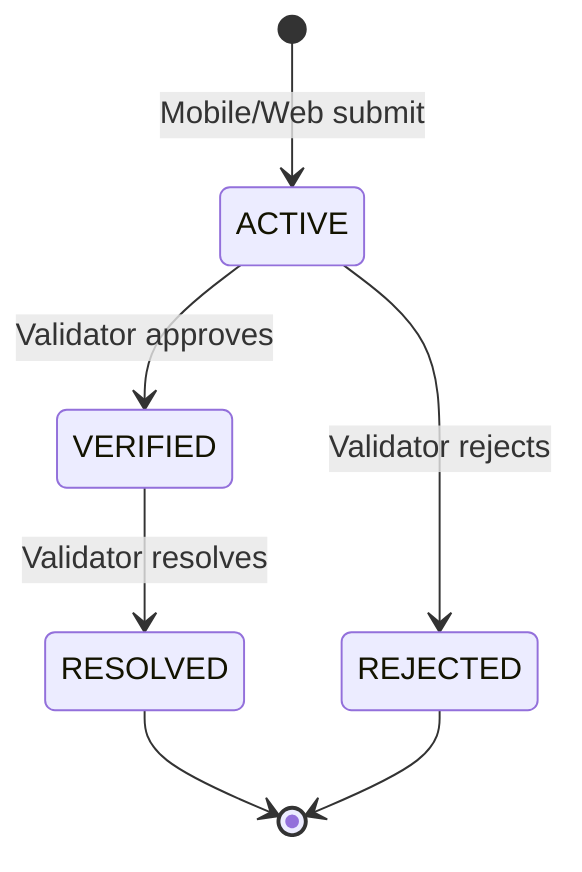

## 16. State: Disaster lifecycle

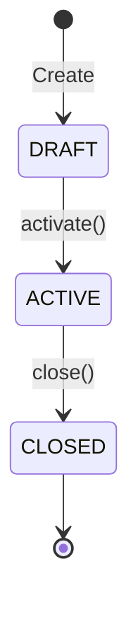

## 17. State: Donation campaign

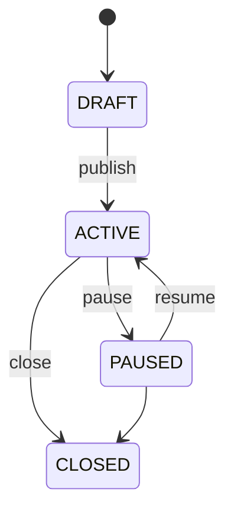

## 18. Use case diagram (condensed from Phase I)

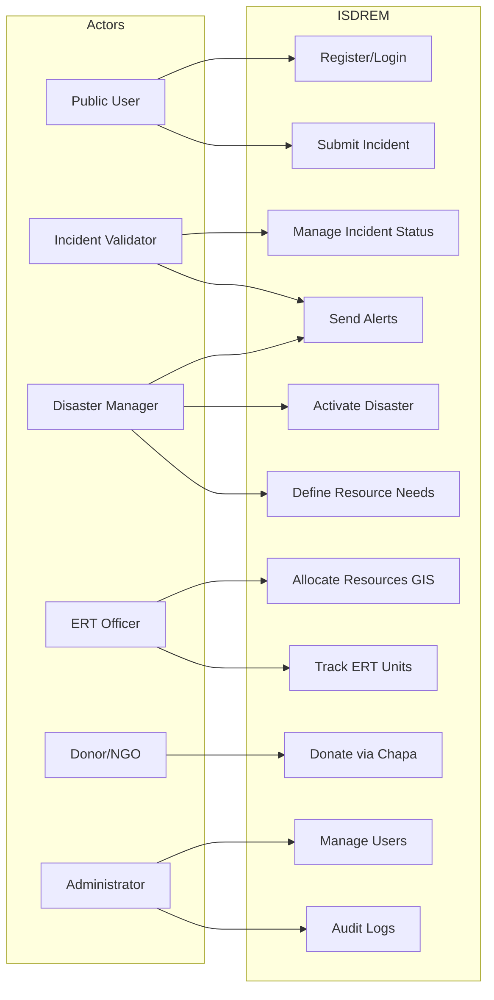

## 19. Class diagram (core domain — simplified)

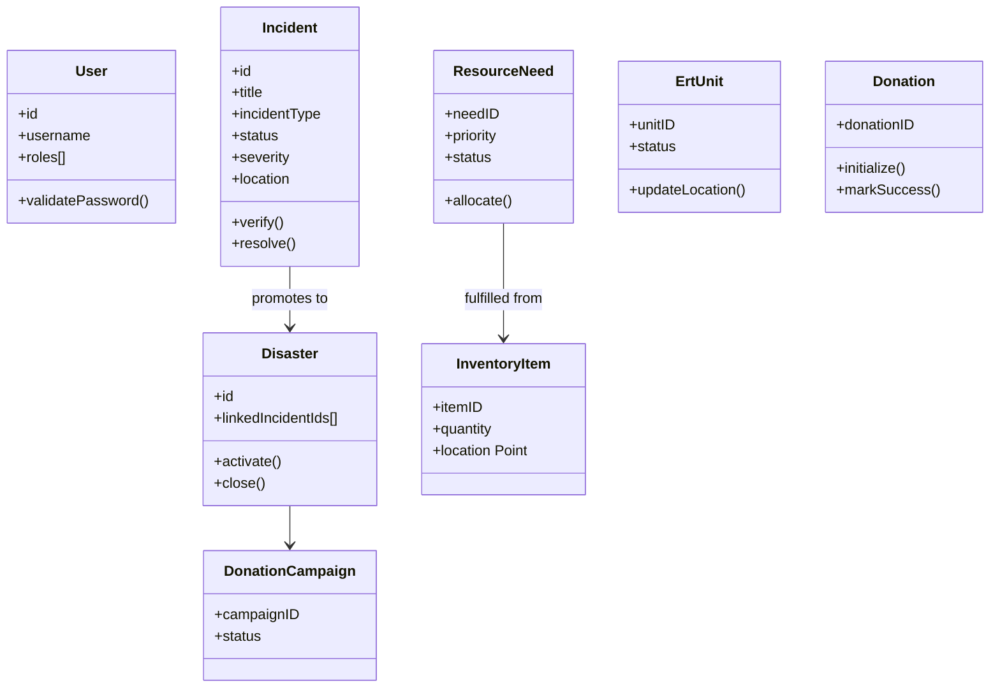

## 20. Data flow diagram (Level 0)

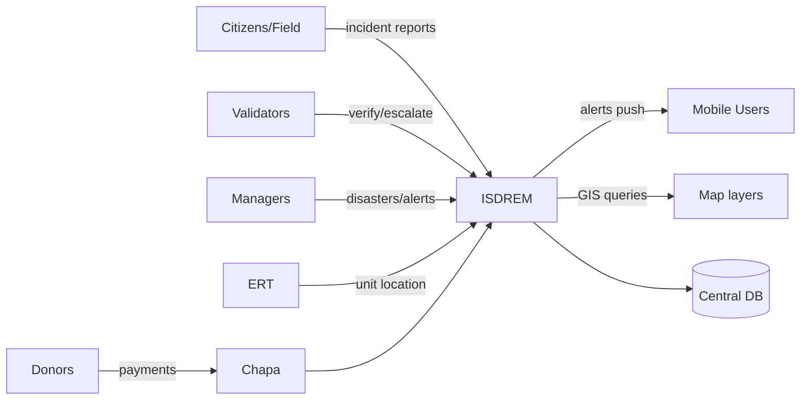

## 21. Knowledge graph (module dependencies)

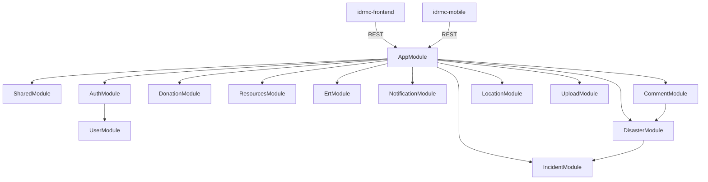

## 22. Module dependency graph (frontend features)

```mermaid
graph LR
  layouts[app layouts] --> providers[Clerk + QueryClient]
  incval[/incval pages] --> features_incidents[features/incidents/api]
  disastermanager --> mockData[lib/mock + zustand]
  ert --> mockData
  features_incidents --> fetchClient
  fetchClient --> API[idrmdbkd]
```

---

# PART C — STRUCTURE, FLOWS, PATTERNS

## 23. Folder structure (what each area does)

### `idrmdbkd/`

| Path | Purpose |
|------|---------|
| `src/main.ts` | Bootstrap, CORS, Swagger, static uploads |
| `src/shared/` | Config, logger, filters, ACL base, enums |
| `src/{domain}/domain/` | Entities, repository interfaces |
| `src/{domain}/application/` | Use cases, services, DTOs |
| `src/{domain}/infrastructure/` | TypeORM entities, repos, Chapa client |
| `src/{domain}/interfaces/http/` | Controllers |
| `migrations/` | Users, PostGIS, push token |
| `test/` | e2e (auth, user, donation) |
| `docs/` | ACL, ERT, implementation summary |

### `idrmc-frontend/`

| Path | Purpose |
|------|---------|
| `src/app/(igmr)/incval/` | Validator console |
| `src/app/(igmr)/disastermanager/` | Manager console |
| `src/app/(igmr)/ert/` | ERT console |
| `src/features/*/api/` | TanStack Query hooks per domain |
| `src/proxy.ts` | Clerk middleware + RBAC |
| `src/components/ui/` | shadcn primitives |

### `idrmc-mobile/`

| Path | Purpose |
|------|---------|
| `app/(tabs)/add.tsx` | Field reporting |
| `app/(tabs)/incidents.tsx` | List/filter |
| `api/services/` | Axios incident/disaster |
| `hooks/queries/` | React Query |

---

## 24. User workflow & business process

### End-to-end operational workflow (target state)

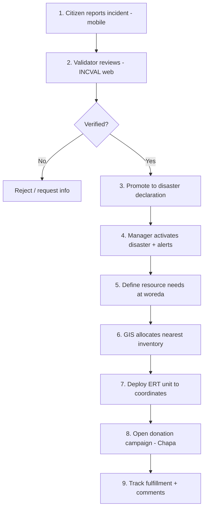

### What works today vs documented

| Step | Backend | Web | Mobile |
|------|---------|-----|--------|
| Report incident | ✅ | Partial | ✅ |
| Verify incident | ✅ API | Partial API | ❌ |
| Declare disaster | ✅ | Mock UI | Read only |
| Alerts | ✅ notification API | Mock/simulated | Mock |
| Resource GIS | ✅ PostGIS | No UI | ❌ |
| ERT map | ✅ `/ert-map` | Placeholder map | ❌ |
| Donations | ✅ Chapa | No UI | Mock |
| Audit logs | ❌ | ❌ | ❌ |
| Offline mobile | ❌ | N/A | ❌ (required in scope) |

---

## 25. Request/response lifecycle (example)

**`POST /api/v1/incidents`**

1. Client sends JSON body matching `CreateIncidentDto`
2. `ValidationPipe` validates enums, lengths
3. `CreateIncidentUseCase` builds domain `Incident`
4. `IncidentTypeOrmRepository` persists
5. Response wrapped in `BaseApiResponseDto` shape
6. Logging interceptor records request ID from middleware

---

## 26. State management flow

| Client | Server state | Local/UI state |
|--------|--------------|----------------|
| Web | TanStack Query cache, keys in `query-keys.ts` | Zustand notifications, React `useState` in tables |
| Mobile | React Query (`useIncidents`, etc.) | Per-screen filters, modals |
| Backend | Stateless JWT; DB is source of truth | N/A |

**Invalidation pattern (mobile):** on `useCreateIncident` success → invalidate `['incidents']` query key.

---

## 27. Caching & performance

| Layer | Caching |
|-------|---------|
| React Query | In-memory stale-time defaults; no persist |
| Backend | None (no Redis) |
| PostGIS | GIST indexes on `ert_units.location`, inventory |
| Static uploads | Express static, no CDN |
| DB | `synchronize: true` — no migration-only discipline |

**Performance considerations for defense:**

- Spatial indexes help nearby queries
- No pagination enforced on all list endpoints (check per controller)
- Open CORS + no rate limiting = DoS risk
- Image uploads to local disk — not scalable horizontally without shared storage

---

## 28. Security architecture & vulnerabilities

| Control | Status |
|---------|--------|
| Password hashing (bcrypt) | ✅ users |
| JWT RS256 | ✅ |
| Role-based ACL (users) | ✅ partial |
| API auth on domain routes | ❌ largely missing |
| Clerk ↔ API token bridge | ❌ |
| Chapa webhook HMAC | ✅ |
| Audit logging | ❌ documented only |
| HTTPS in production | ✅ (Render) |
| Input validation | ✅ class-validator |
| `synchronize: true` | ⚠️ production risk |
| File upload auth | ❌ open upload |
| IDOR on `/users/:id` | ⚠️ unguarded |

---

## 29. Scalability & performance

**Documented intent:** Docker, load balancing, auto-scaling (Phase I NFR).

**Reality:** Monolith NestJS + single Postgres; vertical scaling on Render.

**To scale horizontally you would need:**

- Shared file storage (S3) for uploads
- Redis for sessions/cache
- Disable `synchronize`, use migrations only
- API gateway + rate limits
- Read replicas for reporting
- WebSocket layer for live ERT positions

---

## 30. Engineering principles & design patterns

| Principle | Application |
|-----------|-------------|
| **DDD** | Domain modules with entities, repos, use cases |
| **Hexagonal / ports-adapters** | Repository interfaces in domain |
| **Separation of concerns** | Controllers thin, services orchestrate |
| **SOLID** | DI via NestJS; interface tokens `Symbol.for()` |
| **Scrum / Agile** | Documented sprints, product backlog |
| **PIECES analysis** | Phase I problem framing |
| **Idempotency** | Donation initialize |
| **State machine** | Donation entity, campaign status |

---

## 31. Technology stack & tradeoffs

| Choice | Why (documented) | Tradeoff |
|--------|------------------|----------|
| **NestJS** | Structure, TypeScript, enterprise patterns | Heavier than Express alone |
| **PostgreSQL + PostGIS** | GIS resource/ERT queries | Ops complexity vs Mongo |
| **Next.js** | SSR, App Router, Vercel deploy | Template debt in repo |
| **Expo** | Fast mobile delivery, OTA | Not true offline-first yet |
| **Clerk** | Fast auth UX | Second auth system vs JWT API |
| **Chapa** | Local payment gateway | Vendor lock-in |
| **TypeORM** | Nest integration | `synchronize` foot-gun |
| **Monorepo (3 repos)** | Team parallel work | Integration drift |

**Document says React + Node; implementation uses NestJS on Node** — acceptable refinement for defense.

---

## 32. Critical algorithms & business logic

1. **PostGIS nearest inventory** — `ST_DWithin` + distance sort for allocation
2. **Donation idempotency** — same key returns existing checkout URL
3. **Chapa webhook verification** — HMAC signature check before status update
4. **Incident → disaster mapping** — enum cast mapping in `CreateDisasterFromIncidentUseCase`
5. **Campaign state machine** — DRAFT→ACTIVE→PAUSED→CLOSED
6. **User ACL** — `forActor(user).canDoAction(Update, targetUser)`

---

## 33. Weaknesses, technical debt, improvements

| Item | Severity |
|------|----------|
| Unauthenticated domain APIs | Critical |
| Dual auth (Clerk vs JWT) | High |
| Frontend mock vs API drift | High |
| No audit log module | High (FR-6.2) |
| No offline mobile sync | High (scope) |
| No SMS gateway | Medium (FR-2.3) |
| `synchronize: true` | Medium |
| ERT path `/ert-map` vs docs `/ert/map` | Low |
| CQRS unused | Low |
| `example` module dead code | Low |
| articles migration orphan | Low |

**Phase II recommendations (typical):** WebSockets for ERT, expand tests, production hardening.

---

## 34. Documentation vs implementation gaps

| Requirement (Phase I) | Implementation |
|----------------------|----------------|
| FR-2.3 Geo-targeted SMS alerts | Push via Expo only; no SMS |
| FR-6.2 Audit logs | Not built |
| Offline mobile + sync | Not built |
| Automatic early warning | Out of scope (manual alerts) |
| DDD domain events between contexts | Not wired |
| ERT web dashboard | Mock |
| Donation UI | API only |
| Node.js backend (generic) | NestJS (fine) |
| All roles in use case diagram | Clerk metadata + 2 API roles only |

---

## 35. Code you must understand cold

### Backend bootstrap & module registration

- `idrmdbkd/src/main.ts`, `app.module.ts`

### Incident → disaster promotion

File: `idrmdbkd/src/disaster/application/use-cases/create/create-disaster-from-incident.use-case.ts`

- Checks `incident.getStatus() !== IncidentStatus.VERIFIED`
- Error message incorrectly says "resolved first"

### Donation initialize (idempotency + Chapa)

File: `idrmdbkd/src/donation/application/services/donation-transaction.service.ts`

- `findByIdempotencyKey` returns cached checkout URL
- Chapa initialize + webhook HMAC verification

### Web RBAC

File: `idrmc-frontend/src/proxy.ts`

- `routeAccessMap` by role
- Redirect to default dashboard if wrong role

### Mobile field report entry

- `idrmc-mobile/app/(tabs)/add.tsx` — GPS, upload, `useCreateIncident`

---

# PART D — DEFENSE PREPARATION

## Presentation-ready executive summary (2 min)

ISDREM digitizes EDRMC disaster operations: **standardized incident reporting**, **validator workflows**, **disaster declaration**, **resource tracking with PostGIS**, **ERT deployment maps**, and **Chapa-powered donations**. Architecture is a **NestJS monolith** with **DDD-style modules**, **Next.js role consoles**, and an **Expo field app**. The strongest engineering work is **backend domain modeling + spatial logistics + payment webhooks**. The main gap is **end-to-end integration and security hardening** — Clerk on clients, JWT on API, many screens still mock, and audit/SMS/offline features from requirements not yet delivered.

---

## Beginner explanation

The system lets people report disasters from their phone, officials check those reports on a website, and managers turn serious cases into official disasters. Supplies and rescue teams can be found on a map. People can donate money online. Everything is stored in one database.

## Intermediate explanation

Three apps share one REST API. Mobile creates incidents with GPS and photos. Web apps split by job: validators, disaster managers, ERT. The API uses clean architecture for disaster domains and PostGIS for "find nearest supplies/teams." Clerk handles login on clients; the API has its own JWT system that is not fully connected.

## Advanced explanation

Bounded contexts are implemented as Nest modules with onion layering (domain/application/infrastructure/interfaces). Spatial allocation uses geography-typed columns and `ST_DWithin`. Donations implement aggregate-style state transitions with gateway idempotency. Cross-cutting concerns use Winston logging, request IDs, and a global exception filter. Tactical DDD is partial: aggregates/events exist in `module` entity but CQRS bus is not registered; strategic context integration via domain events is documented but not implemented.

---

# PART E — MOCK DEFENSE COMMITTEE Q&A

### Q1: Why two authentication systems?

**A:** Clerk accelerated UI delivery (sign-in, MFA, session). The API retained the MonstarLab starter JWT stack for REST security. The intended end state is either Clerk-issued JWTs verified by a Nest guard, or a BFF that exchanges Clerk sessions for API tokens. Currently they are **decoupled**, which is technical debt we acknowledge.

### Q2: How do you justify DDD if CQRS isn't wired?

**A:** DDD here means **bounded modules, ubiquitous language in entities, and repository ports** — not full event sourcing. CQRS was explored (`AggregateRoot` on organizational `Module`) but deferred; use cases provide command-side orchestration sufficient for current scale.

### Q3: Your APIs are open — isn't that unacceptable for a government system?

**A:** Correct for production. Mitigation plan: global `JwtAuthGuard`, role decorators per route, align Clerk roles with `ROLE` enum, protect uploads, add rate limiting. Tests should cover 401/403 per endpoint. This is the **highest-priority hardening task**.

### Q4: How does GIS allocation work?

**A:** Inventory items store `geometry(Point,4326)`. When a need is allocated, the service queries items within radius meters using PostGIS, orders by distance, and returns an allocation plan with remaining unfulfilled quantity. Same pattern for ERT nearby via `/ert-map/nearby`.

### Q5: Why `synchronize: true` with migrations?

**A:** Development velocity during academic timeline. Production must set `synchronize: false` and rely on migrations only — we document this in deployment recommendations.

### Q6: Phase I requires offline mobile — where is it?

**A:** Scoped and risk-mitigated in documents (AsyncStorage + sync queue) but **not implemented**. Current app requires network for submit; mock data on home notifications only. Honest gap with planned work: NetInfo + local SQLite/WatermelonDB + background sync.

### Q7: How are donations secured?

**A:** Server-side Chapa initialization, webhook HMAC verification, idempotency keys prevent duplicate charges, campaign must be ACTIVE, PDF receipts generated server-side. Client never trusts payment success without webhook confirmation.

### Q8: Incident vs disaster — what's the difference?

**A:** **Incident** = field report (may be unverified). **Disaster** = institutional declaration with budget, linked incidents, comments, campaigns. Promotion requires verified incident via `POST /disasters/from/:id`.

### Q9: Why mock data on disaster manager dashboard?

**A:** Frontend was bootstrapped from shadcn dashboard template; API hooks were generated per `AGENTS.md` convention but UI wiring is incomplete. Backend endpoints exist; integration is a known sprint item.

### Q10: How does this map to EDRMC's PIECES problems?

| PIECES | ISDREM answer |
|--------|----------------|
| Performance | Real-time API vs 48h paper delay |
| Information | Central Postgres vs siloed LEAP/NMIS |
| Economy | Resource visibility reduces duplication |
| Control | RBAC + audit (audit pending) |
| Efficiency | Automated workflows vs manual fax |
| Service | Mobile reporting + push (SMS pending) |

### Q11: Scalability during national crisis?

**A:** Stateless API scales horizontally once DB connection pooling, shared upload storage, and read replicas are added. PostGIS indexes support spatial load. Bottleneck today is monolith + single DB + local disk — acceptable for pilot, not for peak national load without infra upgrades.

### Q12: Legal compliance (PDPP 1321/2024)?

**A:** Password hashing, role separation, consent via registration, data minimization in incident reports. Gaps: audit trail, data retention policy automation, encryption at rest documentation, DPIA for location data — recommend before production with EDRMC legal.

---

# PART F — STEP-BY-STEP STUDY PLAN

### Week-style progression

1. **Day 1 — Business:** Read Phase I Ch.1–2 (problem, FR/NFR). Draw actors: public, validator, manager, ERT, admin.
2. **Day 2 — Backend map:** Walk `app.module.ts` → pick `incident`, `disaster`, `donation` modules; trace one POST each.
3. **Day 3 — GIS:** Read `docs/IMPLEMENTATION_SUMMARY.md`; trace inventory allocate + ERT nearby.
4. **Day 4 — Auth:** Diagram Clerk vs JWT; list unguarded routes.
5. **Day 5 — Web:** Walk `proxy.ts` + one INCVAL flow (`pending` incidents table → API).
6. **Day 6 — Mobile:** Walk `add.tsx` end-to-end.
7. **Day 7 — Gaps:** Build a table: FR-ID vs ✅/⚠️/❌ — defend honestly.
8. **Day 8 — Mock defense:** Practice Q&A above aloud.

### One-sentence per module (memorize)

| Module | One sentence |
|--------|----------------|
| incident | Captures and updates field reports through their lifecycle. |
| disaster | Elevates verified incidents into managed disaster records with economics and links. |
| resources | Catalogs supplies, stockpiles them at map points, fulfills needs by proximity. |
| ert | Tracks team units, status, and deployment coordinates for command maps. |
| donation | Runs campaigns and Chapa payment with idempotent checkout. |
| notification | Stores in-app notifications and sends Expo push broadcasts. |
| comment | Threaded discussion on disasters. |
| location | Administrative/geo locations for incidents and teams. |
| user/auth | Identity, bcrypt passwords, JWT, ACL for user admin. |
| upload | Stores attachment images on server disk. |

---

# Understand Anything knowledge graph (conceptual)

Per the Understand Anything skill, a full graph would live at `.understand-anything/knowledge-graph.json` with nodes like `file:src/incident/...` and edges `imports`/`calls`. For this workspace, the **architectural knowledge graph** is:

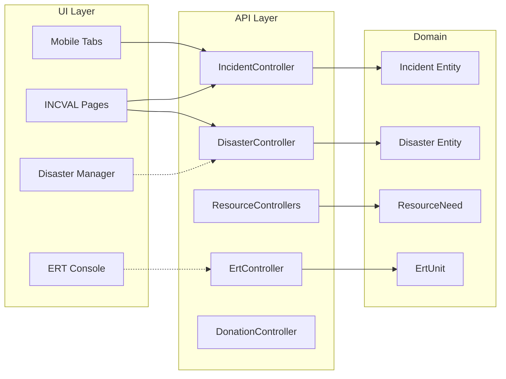

To generate the interactive dashboard locally: install the Understand Anything plugin and run `/understand` in each repo.

---

# Complete API reference (backend)

**Base URL:** `http://host:3000/api/v1`

### App

| Method | Route |
|--------|-------|
| GET | `/` |

### Auth

| Method | Route |
|--------|-------|
| POST | `/auth/login` |
| POST | `/auth/register` |
| POST | `/auth/refresh-token` |

### Users

| Method | Route | Auth |
|--------|-------|------|
| GET | `/users/me` | JWT |
| GET | `/users` | JWT + roles |
| GET | `/users/:id` | Open |
| PATCH | `/users/:id` | Open |

### Incidents

| Method | Route |
|--------|-------|
| POST | `/incidents` |
| GET | `/incidents`, `/incidents/:id` |
| PUT | `/incidents/:id` |
| DELETE | `/incidents/:id` |
| PUT | `/incidents/:id/resolve` |

### Disasters

| Method | Route |
|--------|-------|
| POST | `/disasters` |
| GET | `/disasters`, `/disasters/:id` |
| PUT | `/disasters/:id` |
| POST | `/disasters/from/:id` |
| DELETE | `/disasters/:id` |

### Resources

| Method | Route |
|--------|-------|
| POST/GET/PATCH/DELETE | `/resources`, `/resources/:id` |
| GET | `/resources/map?lat&lon&radiusKm` |
| POST/GET/PATCH/DELETE | `/resources/inventory`, etc. |
| POST/GET/PATCH | `/resources/needs`, allocate, fulfillment |

### ERT

| Method | Route |
|--------|-------|
| POST/GET/PATCH/DELETE | `/ert`, `/ert/:id` |
| GET | `/ert-map`, `/ert-map/nearby` |

### Donations

| Method | Route |
|--------|-------|
| POST/GET/PATCH | `/donations/campaigns` |
| POST | `/donations/initialize` |
| POST | `/donations/webhooks/chapa` |
| GET | `/donations/:id/status`, `/receipt` |

---

# Functional requirements traceability (Phase I)

| ID | Requirement | Backend | Web | Mobile |
|----|-------------|---------|-----|--------|
| FR-1.1 | Register + email verification | JWT register | Clerk sign-up | Clerk sign-up |
| FR-1.2 | Login / Logout | JWT + Clerk | Clerk | Clerk |
| FR-1.3 | Forgot/reset password | Partial | Clerk | Clerk |
| FR-2.1 | Submit incident | ✅ | Partial | ✅ |
| FR-2.2 | Manage incident status | ✅ | Partial | ❌ |
| FR-2.3 | Geo-targeted alerts | Partial (push) | Mock | Mock |
| FR-2.4 | GIS map layers | PostGIS API | Placeholder | Maps on detail |
| FR-3.1 | Activate disaster | ✅ | Mock | Read |
| FR-4.1–4.3 | Donations + Chapa | ✅ | No UI | Mock |
| FR-5.1–5.2 | Resource needs/inventory | ✅ | No UI | ❌ |
| FR-6.1 | Manage users | Partial ACL | No UI | ❌ |
| FR-6.2 | Audit logs | ❌ | ❌ | ❌ |

---

# Files to open before defense

| Priority | Path |
|----------|------|
| 1 | `idrmdbkd/docs/IMPLEMENTATION_SUMMARY.md` |
| 2 | `idrmc-frontend/documet/parsed.txt` |
| 3 | `Final_Edited_Integrated_Information_System_for_Disaster_Recovery.docx` |
| 4 | `Integrated_Information_System_for_Disaster_Response_and_Emergency (3).docx` |
| 5 | `idrmdbkd/src/app.module.ts` |
| 6 | `idrmc-frontend/src/proxy.ts` |
| 7 | `idrmc-mobile/app/(tabs)/add.tsx` |

---

# Document sources

| Document | Phase | Content |
|----------|-------|---------|
| `Integrated_Information_System_for_Disaster_Response_and_Emergency (3).docx` | Phase I | Requirements, use cases, analysis |
| `Final_Edited_Integrated_Information_System_for_Disaster_Recovery.docx` | Phase II | OOD, DDD architecture, testing, deployment |
| `idrmc-frontend/documet/parsed.txt` | Extracted Phase I text | Searchable requirements |

---

*Generated for university defense preparation — ISDREM / IDRMC integrated system analysis.*
