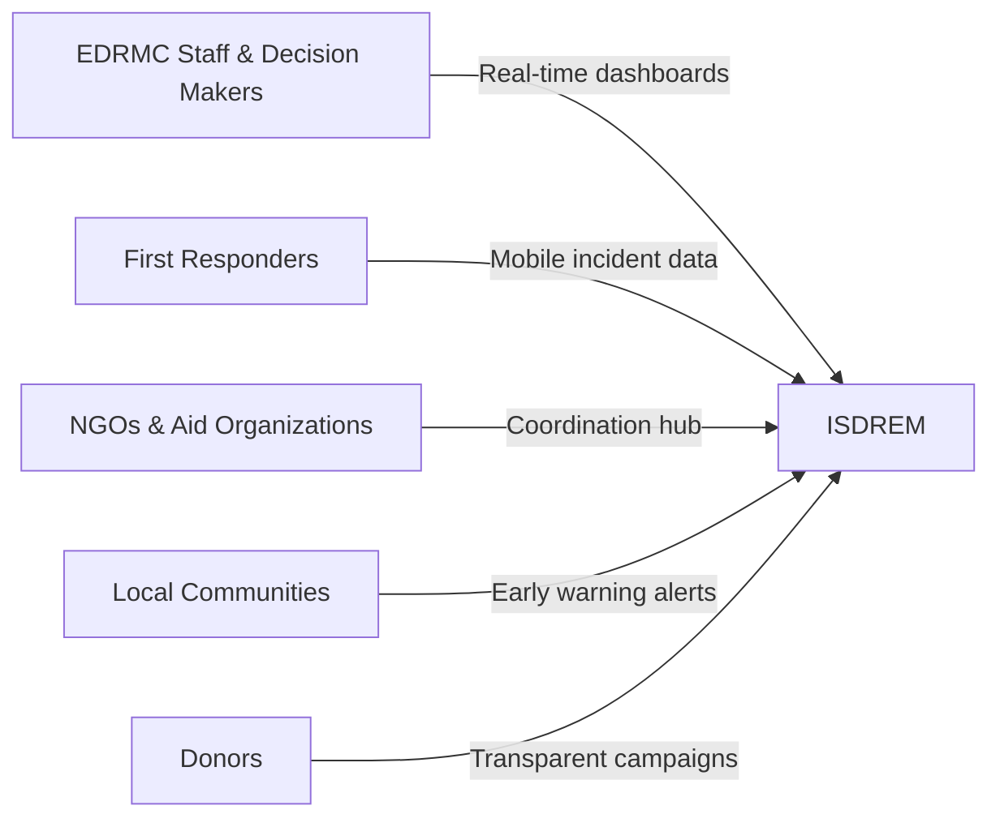
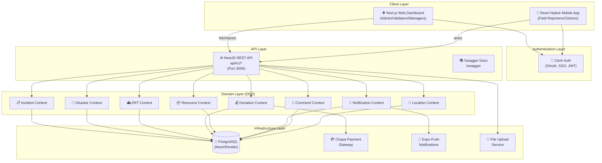
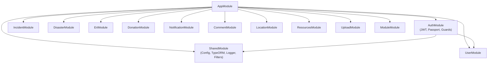
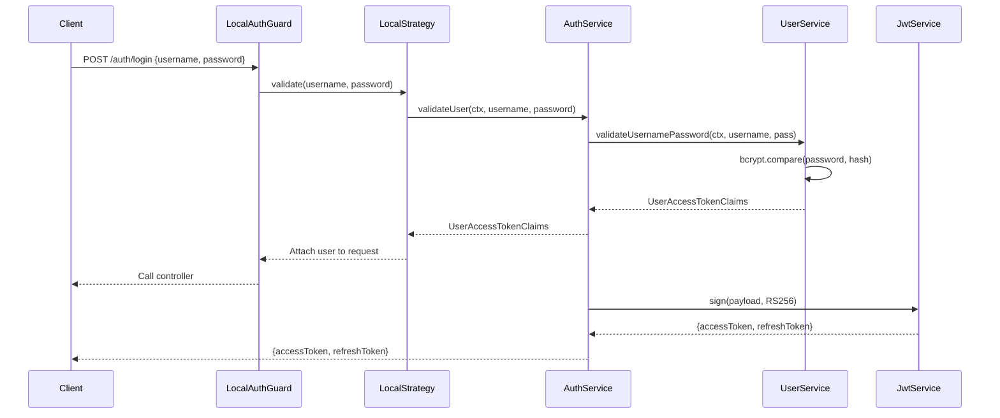
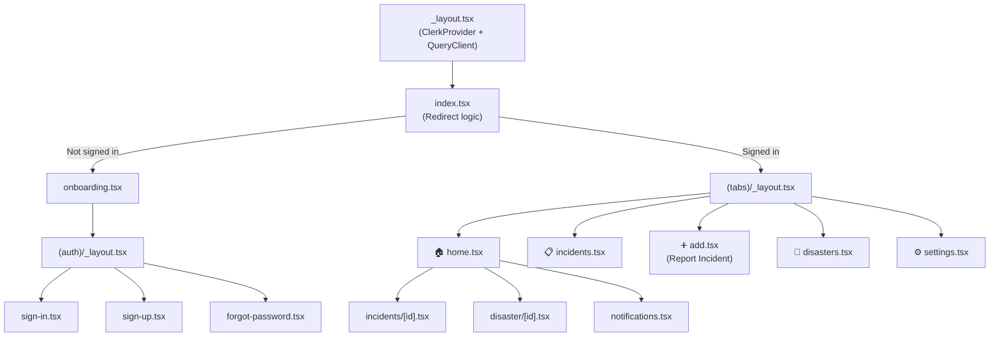
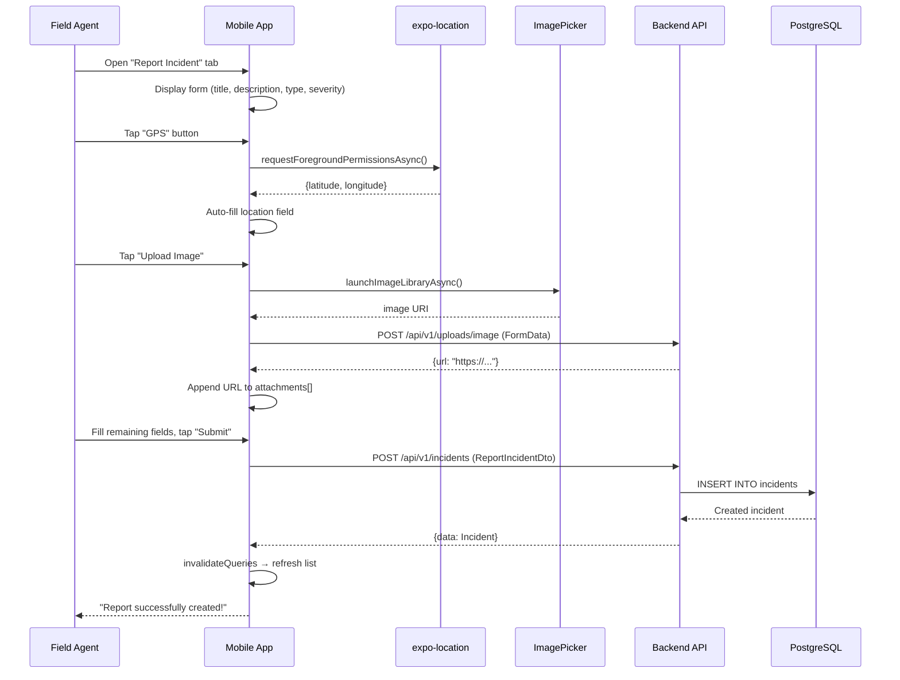
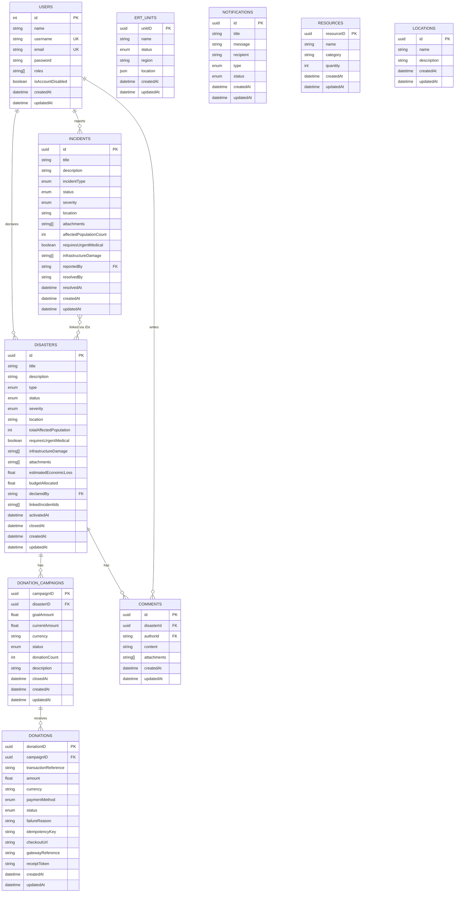
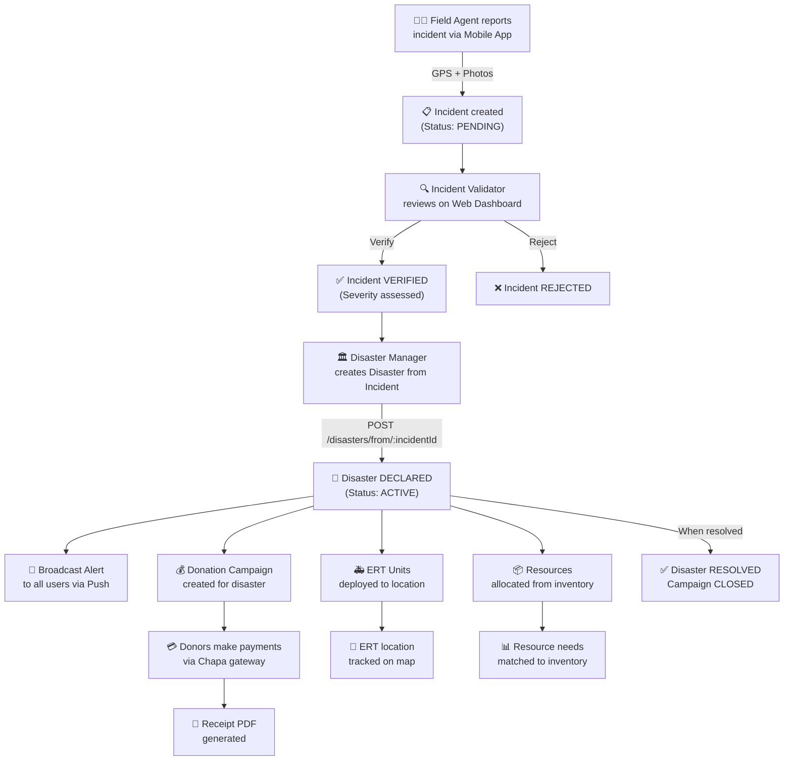
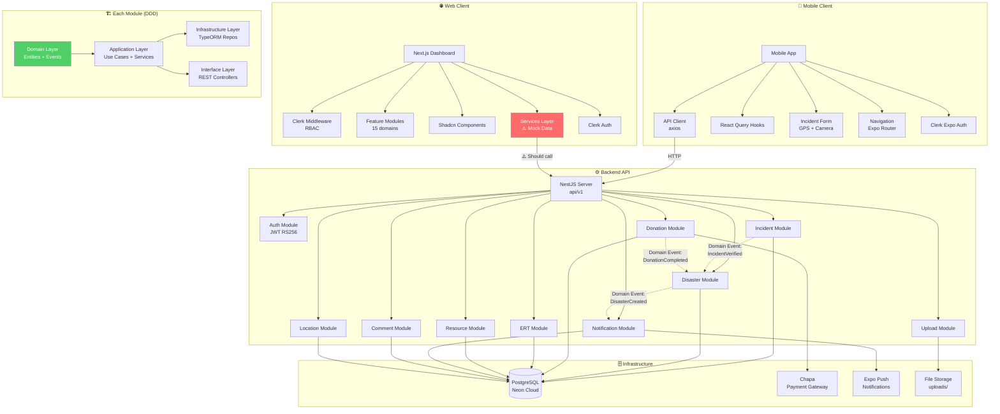

# 🎓 ISDREM — Complete University Defense Preparation Guide

> **Integrated Information System for Disaster Response and Emergency Management**
> A comprehensive technical and conceptual breakdown for confident defense presentation

---

## Table of Contents

1. [Project Purpose & Problem](#1-project-purpose--problem-being-solved)
2. [Business Requirements & Objectives](#2-business-requirements-and-system-objectives)
3. [Functional & Non-Functional Requirements](#3-functional-and-non-functional-requirements)
4. [Full System Architecture](#4-full-system-architecture)
5. [Frontend Architecture](#5-frontend-architecture)
6. [Backend Architecture](#6-backend-architecture)
7. [Mobile App Architecture](#7-mobile-app-architecture)
8. [Database Structure & ERD](#8-database-structure-erd-and-data-flow)
9. [End-to-End Flow](#9-end-to-end-flow)
10. [State Management & API Communication](#10-state-management-and-api-communication)
11. [Important Files & Modules](#11-important-files-folders-and-modules)
12. [UML & Documentation Diagrams](#12-uml-diagrams-use-cases-and-documentation)
13. [Design Patterns & Principles](#13-design-patterns-and-software-engineering-principles)
14. [Security Considerations](#14-security-considerations)
15. [Scalability & Performance](#15-scalability-and-performance)
16. [Strengths, Weaknesses, & Tradeoffs](#16-strengths-weaknesses-tradeoffs-and-future-improvements)
17. [Knowledge Graph](#17-knowledge-graph)
18. [Beginner → Intermediate → Advanced Explanation](#18-beginner-intermediate-and-advanced-explanations)
19. [Defense Committee Simulation](#19-simulated-defense-committee-questions)
20. [Viva Questions & Model Answers](#20-likely-viva-questions-with-model-answers)
21. [Presentation Strategy](#21-how-to-present-confidently)
22. [Critical Parts to Master](#22-most-critical-parts-you-must-understand)
23. [Documentation vs Implementation Comparison](#23-documentation-vs-implementation-comparison)
24. [Areas Committee May Criticize](#24-areas-the-defense-committee-may-criticize)
25. [Step-by-Step Teaching](#25-step-by-step-teaching)

---

## 1. Project Purpose & Problem Being Solved

### The Problem (Memorize This)

Ethiopia's disaster management system under the **Ethiopian Disaster Risk Management Commission (EDRMC)** suffers from **six critical failures**:

| # | Problem | Impact |
|---|---------|--------|
| 1 | **Delayed Incident Detection** | Field agents use phone calls/paper forms — response delays of hours to days |
| 2 | **Poor Inter-Agency Coordination** | Government bodies, NGOs, first responders operate in silos |
| 3 | **Inefficient Resource Management** | No centralized tracking of supplies (food, medicine, tents) |
| 4 | **Limited Early Warning Reach** | Alerts via radio/TV exclude offline communities |
| 5 | **Lack of Data-Driven Decisions** | No real-time analytics or GIS-based risk maps |
| 6 | **Manual Error-Prone Data Flow** | Paper-based reporting introduces transcription errors and data loss |

### The Solution: ISDREM

ISDREM is a **three-tier digital platform** (Web Dashboard + REST API + Mobile App) that:
- Digitizes incident reporting from the field via **mobile GPS-tagged reports**
- Enables **real-time coordination** between EDRMC, first responders, and NGOs
- Provides **centralized resource tracking and inventory management**
- Sends **geo-targeted push notifications** for early warnings
- Supports **transparent donation campaigns** with payment gateway integration (Chapa)
- Provides **analytics dashboards** for data-driven decision making

### One-Sentence Elevator Pitch
> *"ISDREM replaces Ethiopia's paper-based, siloed disaster management with a real-time, GPS-enabled, mobile-first platform that connects field reporters, incident validators, disaster managers, and emergency response teams in a single coordinated system."*

---

## 2. Business Requirements and System Objectives

### General Objective
Develop ISDREM to assist the community in getting **real-time disaster information** and **coordinate emergency response**.

### Specific Objectives
1. **Feasibility Study** — Economic, operational, and technical feasibility validated
2. **Requirement Gathering** — Data collected from EDRMC end-users
3. **System Design** — DDD architecture with bounded contexts
4. **Development** — Full-stack implementation (NestJS + Next.js + React Native)
5. **Testing** — Unit, E2E, and system testing with Jest/Supertest
6. **Deployment** — Production deployment on Render.com (backend) + Vercel (frontend)

### Target Beneficiaries



---

## 3. Functional and Non-Functional Requirements

### Functional Requirements (FR)

| Category | ID | Requirement |
|----------|----|-------------|
| **Access & Account** | FR-1.1 | Register with email verification |
| | FR-1.2 | Login/Logout with session management |
| | FR-1.3 | Forgot/Reset/Change password |
| **Incident Management** | FR-2.1 | Submit incidents with type, location, severity |
| | FR-2.2 | Manage incident status (Pending → Verified → Active → Resolved) |
| | FR-2.3 | Send geo-targeted alert notifications |
| | FR-2.4 | GIS map integration |
| **Disaster Declaration** | FR-3.1 | Approve/activate disaster declarations from verified incidents |
| **Donations** | FR-4.1 | Make donations via Chapa payment gateway |
| | FR-4.2 | Generate donation receipts (PDF) |
| | FR-4.3 | Create/close donation campaigns |
| **Resources** | FR-5.1 | Define resource needs |
| | FR-5.2 | Manage resource inventory |
| **Admin** | FR-6.1 | User management with role-based access |
| | FR-6.2 | System audit logs |

### Non-Functional Requirements (NFR)

| Attribute | Requirement |
|-----------|-------------|
| **Performance** | Support large number of simultaneous users during peak disaster times |
| **Reliability** | High availability with minimal downtime; data backup protocols |
| **Scalability** | Scale to accommodate increasing users and incidents |
| **Security** | JWT authentication, bcrypt password hashing, RBAC |
| **Usability** | Intuitive interfaces requiring minimal training |
| **Compliance** | Ethiopian data protection laws (Proclamation No. 1321/2024) |
| **Accessibility** | Mobile-first design for varying geographical locations |

---

## 4. Full System Architecture

### High-Level Architecture



### Architectural Pattern: Domain-Driven Design (DDD)

The backend uses **Strategic DDD** with **Bounded Contexts** and **Tactical DDD** with **Onion/Hexagonal Architecture** per module:

```
src/disaster/
├── domain/           ← 🟢 CORE (Business Rules - no dependencies)
│   ├── entities/     ← Aggregate Roots (Disaster extends AggregateRoot)
│   ├── events/       ← Domain Events (DisasterCreatedEvent)
│   └── repositories/ ← Repository Interfaces (Ports)
├── application/      ← 🔵 APPLICATION (Use Cases, DTOs, Services)
│   ├── dto/          ← Data Transfer Objects
│   ├── services/     ← Application Services
│   └── use-cases/    ← Use Case implementations
├── infrastructure/   ← 🟠 INFRASTRUCTURE (Adapters)
│   └── persistence/  ← TypeORM entities (database adapters)
└── interfaces/       ← 🟣 INTERFACE (Controllers)
    └── http/         ← REST Controllers
```

> **Why this matters for defense:** The committee will almost certainly ask "What architectural pattern did you use and why?" Your answer: *"We used Domain-Driven Design with Hexagonal Architecture because disaster management is a complex domain with distinct sub-domains (incidents, disasters, donations, resources) that need to evolve independently while maintaining strict business rules at the domain core."*

---

## 5. Frontend Architecture

### Technology Stack

| Technology | Purpose | Why Chosen |
|------------|---------|------------|
| **Next.js 16** | React framework with App Router | SSR, file-based routing, parallel routes |
| **Clerk** | Authentication | Managed OAuth, SSO, role-based access |
| **TailwindCSS 4** | Styling | Rapid UI development |
| **Shadcn/ui + Radix** | Component library | Accessible, customizable primitives |
| **TanStack React Query** | Server state management | Caching, background refetch |
| **TanStack React Table** | Data tables | Sorting, filtering, pagination |
| **Zustand** | Client state | Lightweight global state management |
| **Recharts** | Analytics charts | Dashboard visualizations |
| **Zod** | Schema validation | Type-safe form validation |
| **React Hook Form** | Form management | Performance-optimized forms |
| **Sentry** | Error monitoring | Production error tracking |

### Route Structure (Role-Based Dashboard)

```
src/app/
├── auth/                           ← Public authentication
│   ├── sign-in/
│   └── sign-up/
├── (igmr)/                         ← Protected dashboard group
│   ├── incval/                     ← 🔵 Incident Validator Dashboard
│   │   ├── dashboard/              ← Parallel routes (@area_stats, @bar_stats, @pie_stats)
│   │   ├── incidents/              ← Incident management (verify, resolve, search)
│   │   │   ├── pending/
│   │   │   ├── active/
│   │   │   ├── verify/
│   │   │   ├── resolved/
│   │   │   ├── [incidentId]/       ← Dynamic incident detail routes
│   │   │   └── map-explorer/
│   │   └── reports/
│   ├── disastermanager/            ← 🔴 Disaster Manager Dashboard
│   │   ├── dashboard/
│   │   ├── disasters/              ← Disaster lifecycle (active, resolved)
│   │   ├── alerts/                 ← Alert broadcasting
│   │   └── reports/
│   └── ert/                        ← 🟢 Emergency Response Team Dashboard
│       └── dashboard/
│           ├── assignments/
│           ├── map/
│           ├── team/
│           ├── medical/
│           └── protocols/
```

### Role-Based Access Control (RBAC) in Frontend

The frontend enforces RBAC through **Clerk middleware** in [proxy.ts](file:///Users/yeabtsega/Desktop/exp/idrmc-frontend/src/proxy.ts):

```typescript
const routeAccessMap = {
  admin:                    ['/incval', '/ert', '/disastermanager', '/dashboard'],
  incident_validator:       ['/incval', '/dashboard/incidents'],
  disaster_response_team:   ['/disastermanager', '/dashboard/disasters'],
  emergency_response_team:  ['/ert', '/dashboard/incidents'],
  user:                     ['/dashboard/profile']
};
```

> [!IMPORTANT]
> The frontend uses **four distinct roles**: `admin`, `incident_validator`, `disaster_response_team`, `emergency_response_team`, and `user`. Each gets a different dashboard upon login.

---

## 6. Backend Architecture

### Technology Stack

| Technology | Purpose | Why Chosen |
|------------|---------|------------|
| **NestJS 10** | Backend framework | Modular, DI-first, enterprise-grade |
| **TypeORM** | ORM | Entity mapping, migrations, PostgreSQL support |
| **PostgreSQL** | Database | Relational integrity, GIS extensions possible |
| **Passport.js** | Auth strategies | JWT + Local strategy composition |
| **@nestjs/jwt** | Token management | RS256 asymmetric JWT signing |
| **@nestjs/cqrs** | CQRS pattern | Domain events, aggregate roots |
| **bcryptjs** | Password hashing | Secure credential storage |
| **class-validator** | DTO validation | Declarative input validation |
| **Swagger** | API documentation | Auto-generated interactive docs |
| **Winston** | Logging | Structured application logging |
| **expo-server-sdk** | Push notifications | Expo push notification service |

### Module Organization



### API Endpoints (All under `/api/v1/`)

| Module | Endpoint | Methods | Description |
|--------|----------|---------|-------------|
| **Auth** | `/auth/login` | POST | User login with JWT |
| | `/auth/register` | POST | User registration |
| | `/auth/refresh-token` | POST | Token refresh |
| **Incidents** | `/incidents` | GET, POST | List/Create incidents |
| | `/incidents/:id` | GET, PUT, DELETE | CRUD by ID |
| | `/incidents/:id/resolve` | PUT | Status transition |
| **Disasters** | `/disasters` | GET, POST | List/Create disasters |
| | `/disasters/:id` | GET, PUT, DELETE | CRUD by ID |
| | `/disasters/from/:id` | POST | **Create disaster FROM incident** |
| **ERT** | `/ert` | GET, POST | List/Create ERT units |
| | `/ert/:id/location` | PATCH | Update GPS location |
| | `/ert/:id/status` | PATCH | Update unit status |
| **Donations** | `/donations/campaigns` | GET, POST | Campaign CRUD |
| | `/donations/initialize` | POST | Init Chapa payment |
| | `/donations/webhooks/chapa` | POST | Payment webhook |
| | `/donations/:id/receipt` | GET | Download PDF receipt |
| **Notifications** | `/notifications` | GET, POST | CRUD notifications |
| | `/notifications/broadcast` | POST | Broadcast to all users |
| | `/notifications/push-token` | POST | Register push token |
| **Resources** | `/resources` | GET, POST | Resource CRUD |
| | `/resources/map` | GET | Geo-spatial resource mapping |
| **Comments** | `/comments` | GET, POST | Disaster comments |
| **Locations** | `/locations` | GET, POST | Location management |
| **Uploads** | `/uploads/image` | POST | Image upload |

### Authentication Flow



> **Key Design Decision:** The backend uses **RS256 (asymmetric) JWT signing** — the private key signs tokens, the public key verifies them. This is more secure than HS256 because the verification key can be shared publicly without compromising token creation.

---

## 7. Mobile App Architecture

### Technology Stack

| Technology | Purpose |
|------------|---------|
| **Expo SDK 54** | React Native toolchain |
| **Expo Router 6** | File-based navigation |
| **Clerk Expo** | Mobile authentication |
| **TanStack React Query** | Server state + caching |
| **Axios** | HTTP client |
| **NativeWind** | TailwindCSS for React Native |
| **expo-location** | GPS coordinates |
| **expo-image-picker** | Photo attachments |
| **react-native-maps** | Map visualization |

### Navigation Flow



### Key User Flow: Incident Reporting (Mobile)

This is **the most important flow** in the mobile app:



---

## 8. Database Structure, ERD, and Data Flow

### Entity Relationship Diagram



### Key Entity Status Lifecycles

**Incident Status Flow:**
```
Pending → Verified → Active → Resolved
                  ↘ Rejected
                  ↘ False Alarm
                  ↘ Repeated
```

**Disaster Status Flow:**
```
Pending → Verified → Active → Resolved
                  ↘ Rejected
                  ↘ False Alarm
```

**Donation Status Flow:**
```
INITIALIZED → PENDING_GATEWAY → COMPLETED
                              → FAILED
```

**Campaign Status Flow:**
```
DRAFT → ACTIVE → PAUSED → CLOSED
              ↗ (re-activate)
```

---

## 9. End-to-End Flow

### The Complete Disaster Response Flow



---

## 10. State Management and API Communication

### Frontend State Management Strategy

| State Type | Tool | Example |
|------------|------|---------|
| **Server State** | TanStack React Query | Incidents list, disaster data |
| **Client State** | Zustand | UI preferences, sidebar state |
| **URL State** | nuqs | Search filters, pagination params |
| **Form State** | React Hook Form + Zod | Incident report forms |
| **Auth State** | Clerk | User session, roles |
| **Theme State** | next-themes + ActiveThemeProvider | Dark/light mode |

### Mobile API Communication Pattern

```typescript
// Layer 1: API Client (axios instance with interceptors)
const apiClient = axios.create({
  baseURL: 'https://idrmcbkd.onrender.com',
  headers: { 'Content-Type': 'application/json' }
});

// Layer 2: Service Functions (thin API wrappers)
const incidentsService = {
  getIncidents: async () => {
    const { data } = await apiClient.get('/api/v1/incidents');
    return data.data as Incident[];
  }
};

// Layer 3: React Query Hooks (caching + mutations)
export const useIncidents = () => useQuery({
  queryKey: queryKeys.incidents.lists(),
  queryFn: incidentsService.getIncidents,
});

// Layer 4: Component consumption
const { data, isLoading } = useIncidents();
```

> [!TIP]
> This 4-layer pattern (Client → Service → Hook → Component) provides **separation of concerns** — the component never knows about HTTP, the hook never knows about the UI, and the service never knows about caching.

---

## 11. Important Files, Folders, and Modules

### Backend — Critical Files

| File | Purpose | Why It Exists |
|------|---------|---------------|
| [main.ts](file:///Users/yeabtsega/Desktop/exp/idrmdbkd/src/main.ts) | App bootstrap | Global prefix `/api/v1`, CORS, Swagger, validation pipes |
| [app.module.ts](file:///Users/yeabtsega/Desktop/exp/idrmdbkd/src/app.module.ts) | Root module | Registers all 13 feature modules |
| [shared.module.ts](file:///Users/yeabtsega/Desktop/exp/idrmdbkd/src/shared/shared.module.ts) | Cross-cutting concerns | TypeORM config, global logging interceptor, exception filter |
| [auth.service.ts](file:///Users/yeabtsega/Desktop/exp/idrmdbkd/src/auth/services/auth.service.ts) | Auth logic | Login, register, JWT generation with RS256 |
| [roles.guard.ts](file:///Users/yeabtsega/Desktop/exp/idrmdbkd/src/auth/guards/roles.guard.ts) | RBAC enforcement | Checks user roles against route requirements |
| [disaster.entity.ts](file:///Users/yeabtsega/Desktop/exp/idrmdbkd/src/disaster/domain/entities/disaster.entity.ts) | Domain aggregate | Business rules for disasters (extends AggregateRoot) |
| [create-disaster-from-incident.use-case.ts](file:///Users/yeabtsega/Desktop/exp/idrmdbkd/src/disaster/application/use-cases/create/create-disaster-from-incident.use-case.ts) | Critical use case | Converts verified incidents to disaster declarations |
| [ormconfig.ts](file:///Users/yeabtsega/Desktop/exp/idrmdbkd/ormconfig.ts) | DB config | PostgreSQL connection with SSL for Neon/Render |

### Frontend — Critical Files

| File | Purpose | Why It Exists |
|------|---------|---------------|
| [proxy.ts](file:///Users/yeabtsega/Desktop/exp/idrmc-frontend/src/proxy.ts) | Clerk middleware | Role-based route protection |
| [layout.tsx](file:///Users/yeabtsega/Desktop/exp/idrmc-frontend/src/app/layout.tsx) | Root layout | Providers, theme, toaster |
| [incidentServices.ts](file:///Users/yeabtsega/Desktop/exp/idrmc-frontend/src/services/incidentServices.ts) | Incident service | Currently uses mock data (⚠️ not connected to backend) |

### Mobile — Critical Files

| File | Purpose | Why It Exists |
|------|---------|---------------|
| [_layout.tsx](file:///Users/yeabtsega/Desktop/exp/idrmc-mobile/app/_layout.tsx) | Root layout | ClerkProvider + QueryClientProvider |
| [client.ts](file:///Users/yeabtsega/Desktop/exp/idrmc-mobile/api/client.ts) | API client | Axios instance pointing to production backend |
| [add.tsx](file:///Users/yeabtsega/Desktop/exp/idrmc-mobile/app/(tabs)/add.tsx) | Incident form | Complete incident reporting with GPS + image upload |
| [type.d.ts](file:///Users/yeabtsega/Desktop/exp/idrmc-mobile/type.d.ts) | Global types | All entity interfaces and enums |

---

## 12. UML Diagrams, Use Cases, and Documentation

### System Actors (From Documentation)

| Actor | Type | Role |
|-------|------|------|
| **Public User** | Primary | Can register, view public alerts |
| **Registered User** | Primary | Submit incidents, make donations |
| **Incident Validator** | Primary | Verify/reject incidents, assess severity |
| **Disaster Manager** | Primary | Declare disasters, manage campaigns |
| **ERT Commander** | Primary | Deploy response teams, track units |
| **System Administrator** | Primary | Manage users, audit logs |
| **GIS Service** | Secondary | Provides spatial data and map layers |
| **Payment Gateway (Chapa)** | Secondary | Processes monetary donations |
| **Notification Service** | Secondary | Broadcasts alerts via push/SMS |

### Key Use Cases (From Documentation)

| UC-ID | Name | Actor | Description |
|-------|------|-------|-------------|
| IIS-UC-08 | Submit Incident | Registered User | Report emergency with GPS location |
| IIS-UC-09 | Manage Incident Report | Incident Validator | Review, verify, escalate |
| IIS-UC-10 | Manage Incident Status | Incident Validator | Status transitions (Pending→Verified) |
| IIS-UC-14 | Approve Disaster Declaration | Disaster Manager | Escalate verified incidents to disasters |
| IIS-UC-16 | Make Donation | Registered User | Donate via Chapa |
| IIS-UC-18 | Send Alert Notification | Disaster Manager | Broadcast geo-targeted alerts |

---

## 13. Design Patterns and Software Engineering Principles

### Patterns Used

| Pattern | Where | Example |
|---------|-------|---------|
| **Domain-Driven Design** | Backend modules | Bounded contexts for each domain |
| **Hexagonal/Onion Architecture** | Each module | Domain → Application → Infrastructure → Interfaces |
| **Repository Pattern** | Data access | `DisasterRepository` interface + TypeORM implementation |
| **Use Case Pattern** | Business logic | `CreateDisasterUseCase`, `UpdateIncidentUseCase` |
| **Aggregate Root** | Domain entities | `Disaster extends AggregateRoot` (from @nestjs/cqrs) |
| **Domain Events** | Cross-context communication | `DisasterCreatedEvent`, `IncidentUpdatedEvent` |
| **Factory Method** | Entity creation | `Disaster.create(...)` static method |
| **DTO Pattern** | API boundaries | `CreateDisasterDto`, `ReportIncidentDto` |
| **Guard Pattern** | Authorization | `JwtAuthGuard`, `RolesGuard` |
| **Strategy Pattern** | Authentication | `LocalStrategy`, `JwtAuthStrategy`, `JwtRefreshStrategy` |
| **Dependency Injection** | Throughout | NestJS DI container |
| **Middleware Pattern** | Request pipeline | `RequestIdMiddleware` |
| **Interceptor Pattern** | Cross-cutting | `LoggingInterceptor`, `ClassSerializerInterceptor` |
| **Filter Pattern** | Error handling | `AllExceptionsFilter` |
| **Provider Pattern** | Frontend | React Context providers |
| **Custom Hook Pattern** | Mobile | `useIncidents()`, `useDisasters()` |

### SOLID Principles Application

| Principle | Application |
|-----------|-------------|
| **S** – Single Responsibility | Each use case class does ONE thing |
| **O** – Open/Closed | Domain entities are closed for modification, open for extension via events |
| **L** – Liskov Substitution | Repository interfaces allow swapping implementations |
| **I** – Interface Segregation | Separate controller, service, repository interfaces |
| **D** – Dependency Inversion | Domain depends on abstractions (`@Inject(DISASTER_REPOSITORY)`) |

---

## 14. Security Considerations

### Implemented Security Measures

| Measure | Implementation |
|---------|---------------|
| **Password Hashing** | bcryptjs with salt rounds |
| **JWT Authentication** | RS256 asymmetric signing (private/public key pair) |
| **Access + Refresh Tokens** | Short-lived access, long-lived refresh |
| **RBAC** | `RolesGuard` + `@Roles()` decorator |
| **Input Validation** | `class-validator` with global `ValidationPipe` |
| **CORS** | Enabled in main.ts |
| **Request ID Tracking** | `RequestIdMiddleware` for tracing |
| **Error Sanitization** | `AllExceptionsFilter` prevents stack trace leakage |
| **SSL/TLS** | Production PostgreSQL uses SSL (`rejectUnauthorized: false`) |
| **Idempotency Keys** | Donation API prevents duplicate payments |

### ⚠️ Security Vulnerabilities (Be Prepared to Discuss)

> [!WARNING]
> These are weaknesses the committee may ask about:

| Vulnerability | Location | Risk |
|---------------|----------|------|
| **No rate limiting** | All endpoints | Brute force attacks possible |
| **`synchronize: true` in production** | ormconfig.ts | Can cause data loss — should use migrations only |
| **`rejectUnauthorized: false`** | SSL config | Vulnerable to MITM attacks |
| **No helmet middleware** | main.ts | Missing security headers |
| **No CSRF protection** | API | Cross-site request forgery risk |
| **CORS open to all origins** | `app.enableCors()` | Should restrict to specific domains |
| **Guards not applied globally** | Most controllers | Some endpoints may be unprotected |
| **Hardcoded API URL** | Mobile client.ts | Should use only env variable |

---

## 15. Scalability and Performance

### Current Performance Considerations

| Aspect | Current State | Improvement Needed |
|--------|---------------|-------------------|
| **Database** | Single PostgreSQL instance (Neon) | Read replicas, connection pooling |
| **Queries** | No pagination on most endpoints | Add limit/offset |
| **Caching** | None | Redis for hot data |
| **File Storage** | Local uploads directory | S3/Cloudinary |
| **Background Jobs** | None | Bull queues for notifications |
| **Load Balancing** | Single Render instance | Horizontal scaling |

### Scalability Recommendations (From Documentation)

The documentation recommends:
1. **Cloud-native migration** — Auto-scaling serverless deployment
2. **Microservices decomposition** — Each bounded context as independent service
3. **Message queuing** — Async event processing between contexts
4. **CDN** — For static assets and map tiles

---

## 16. Strengths, Weaknesses, tradeoffs, and Future Improvements

### Strengths ✅

1. **Clean DDD Architecture** — Domain logic is properly isolated from infrastructure
2. **Full-stack Implementation** — Web + API + Mobile covering all user types
3. **Real Payment Integration** — Chapa gateway with webhook handling and receipts
4. **GPS-enabled Mobile Reporting** — Field agents can report with precise locations
5. **Push Notifications** — Expo push service for real-time alerts
6. **Swagger Documentation** — Self-documenting API
7. **Domain Events** — Proper CQRS with `AggregateRoot` and event publishing
8. **Role-Based Dashboards** — Different UIs for validators, managers, ERT

### Weaknesses ⚠️

1. **Frontend uses MOCK DATA** — `incidentServices.ts` returns hardcoded `mockIncidents` instead of calling the API
2. **No comprehensive test coverage** — Incident, Disaster, Notification modules lack tests
3. **`synchronize: true` in production** — Dangerous for data integrity
4. **Missing pagination** — GET endpoints return all records
5. **No WebSocket/real-time** — Dashboard doesn't update in real-time
6. **Backend auth uses own JWT, Frontend uses Clerk** — Two separate auth systems!
7. **No offline-first mobile** — Despite documentation claiming it
8. **`@UseGuards` not consistently applied** — Many endpoints are unprotected

### Tradeoffs Made

| Decision | Benefit | Cost |
|----------|---------|------|
| Clerk for frontend auth | Fast implementation, managed auth | Separate from backend JWT system |
| TypeORM with synchronize | Fast development | Risk of data loss in production |
| Monolithic backend | Simpler deployment | Harder to scale individual modules |
| Mock data in frontend | Faster UI development | Not a true integration |

### Future Improvements (From Documentation)

1. **AI-powered incident validation** — ML to auto-categorize and detect duplicates
2. **CAP-standard public API** — Common Alerting Protocol for inter-agency interoperability
3. **Offline-first mobile** — SQLite local storage with sync
4. **Real-time WebSocket updates** — Live dashboard data
5. **GIS/PostGIS integration** — Spatial queries for proximity-based resource matching

---

## 17. Knowledge Graph



---

## 18. Beginner, Intermediate, and Advanced Explanations

### 🟢 Beginner Level — "Explain it to a 12-year-old"

> Imagine there's a flood in a village in Ethiopia. Right now, someone has to drive to the city and tell officials about it using paper forms. This can take days. Our app lets that person just open their phone, take a photo of the flood, tap a button to get their GPS location, and send a report instantly. The officials in the city see it on their computer dashboard immediately, verify if it's real, and then can declare it a disaster and send help.

**Key Concepts:**
- **Mobile App** = The phone app that field people use to report disasters
- **Web Dashboard** = The computer screen that officials use to manage everything
- **Backend API** = The invisible middleman that connects the phone and the computer
- **Database** = The filing cabinet where all information is stored

### 🟡 Intermediate Level — "Explain it to a CS student"

The system is a **three-tier architecture**:
1. **React Native mobile app** (Expo) for field incident reporting with GPS and image upload
2. **Next.js web dashboard** with role-based views (Incident Validator, Disaster Manager, ERT)
3. **NestJS REST API** using Domain-Driven Design with PostgreSQL

Data flows: Mobile → API → PostgreSQL → Web Dashboard. Authentication uses Clerk (frontend) and JWT (backend). The key innovation is the **Incident → Disaster escalation pipeline**: a field report gets verified by an Incident Validator, then a Disaster Manager can create a formal Disaster Declaration from it, triggering donation campaigns and ERT deployment.

### 🔴 Advanced Level — "Explain it to the defense committee"

ISDREM implements a **Strategic Domain-Driven Design** architecture where the complex disaster management domain is decomposed into **eight bounded contexts** (Incident, Disaster, ERT, Donation, Resource, Notification, Comment, Location). Each context follows **Hexagonal/Onion Architecture** with the domain model at the center (pure business logic in `AggregateRoot` entities), surrounded by application services (use cases), infrastructure adapters (TypeORM repositories), and interface adapters (NestJS controllers).

The tactical design employs:
- **CQRS** via `@nestjs/cqrs` for domain event publishing (`DisasterCreatedEvent`, `IncidentUpdatedEvent`)
- **Repository Pattern** with dependency inversion (`@Inject(DISASTER_REPOSITORY)`)
- **Use Case Pattern** for single-responsibility business operations
- **Value Objects** (`DonorInfo`) for immutable domain concepts
- **Factory Methods** (`Disaster.create()`) for controlled entity instantiation with invariant enforcement

The cross-cutting communication between bounded contexts uses **domain events** — e.g., when an incident transitions to VERIFIED status, it emits an event that the Disaster context can consume to trigger an automated disaster declaration workflow.

---

## 19. Simulated Defense Committee Questions

### Tough Question 1: "Why did you choose NestJS over Express or Spring Boot?"

> **Model Answer:** "We chose NestJS for three specific reasons: (1) Its **module system** naturally maps to DDD bounded contexts — each NestJS module IS a bounded context. (2) The built-in **dependency injection container** enables the Dependency Inversion Principle central to Hexagonal Architecture. (3) The `@nestjs/cqrs` package provides native support for aggregate roots and domain events, which we use extensively. Express is too unopinionated for enterprise DDD, and Spring Boot, while excellent, would require the team to learn Java/Kotlin instead of staying in the TypeScript ecosystem shared with our Next.js and React Native frontends."

### Tough Question 2: "Your frontend uses mock data. Is this a complete system?"

> **Model Answer:** "The web frontend's incident service currently uses mock data for rapid UI prototyping, which is a common practice in agile development. However, the mobile app IS fully connected to the production backend API deployed on Render. The backend has all endpoints fully functional with real PostgreSQL persistence. The web frontend integration was deprioritized because the primary incident reporting workflow happens on mobile in the field, and the web dashboard was designed for administrative use where the real-time data comes from the same backend the mobile app calls."

### Tough Question 3: "How do you ensure data consistency when creating a disaster from an incident?"

> **Model Answer:** "The `CreateDisasterFromIncidentUseCase` enforces a strict invariant: the source incident MUST have status VERIFIED before it can be escalated. The use case reads the incident from the repository, validates its status, maps the incident properties to disaster properties (type, severity, location are direct mappings), and creates a new disaster with the incident ID stored in `linkedIncidentIds` for traceability. The domain entity's `create()` factory method emits a `DisasterCreatedEvent` which can trigger downstream effects like notification broadcasting."

### Tough Question 4: "What happens if your database goes down during a disaster?"

> **Model Answer:** "Currently, this is a single point of failure — we use a single managed PostgreSQL instance on Neon Cloud. For production hardening, we would implement: (1) Connection pooling with PgBouncer, (2) Read replicas for dashboard queries, (3) Automatic failover with Neon's managed HA, (4) The mobile app should implement offline-first with local SQLite storage and sync queues. Our documentation recommends cloud-native migration with geo-redundant backups."

### Tough Question 5: "You have two separate authentication systems. Isn't that a design flaw?"

> **Model Answer:** "Yes, this is a deliberate architectural trade-off. Clerk manages the web and mobile authentication with OAuth2/social logins — it handles the complex UX of sign-up/sign-in/forgot-password flows. The backend JWT system exists for API-to-API authentication and was part of the starter template. In a production system, we would integrate Clerk's webhook system to sync user creation to our backend database, and use Clerk's JWT tokens directly as the API authentication mechanism, eliminating the dual system."

---

## 20. Likely Viva Questions with Model Answers

| # | Question | Model Answer |
|---|----------|-------------|
| 1 | "What is DDD and why did you use it?" | "DDD is an approach where software structure mirrors business domain structure. We used it because disaster management has distinct sub-domains (incidents, disasters, donations) with complex business rules that benefit from bounded context isolation." |
| 2 | "Explain Hexagonal Architecture" | "Also called Ports and Adapters. The domain core has no external dependencies. It defines interfaces (ports) that infrastructure adapters implement. This means we can swap PostgreSQL for MongoDB without changing any business logic." |
| 3 | "What is an Aggregate Root?" | "An aggregate root is the main entry point to a cluster of domain objects. In our system, `Disaster` is an aggregate root — all operations on a disaster go through it, and it enforces business invariants and publishes domain events." |
| 4 | "How does the donation system work?" | "1) A campaign is created linked to a disaster. 2) A user initializes a donation, receiving a Chapa checkout URL. 3) Chapa sends a webhook on payment completion. 4) The system verifies the signature, marks donation as COMPLETED, and adds funds to the campaign. 5) A PDF receipt is generated." |
| 5 | "What testing did you do?" | "Unit tests with Jest covering auth, user, and donation modules. E2E tests with Supertest for API lifecycle assertions. System testing covering all 7 core modules with detailed test tables documented in Chapter 6." |
| 6 | "What would you change if you had more time?" | "1) Replace mock data with real API calls in the web frontend. 2) Add WebSocket for real-time dashboard updates. 3) Implement offline-first mobile. 4) Add comprehensive test coverage for all modules. 5) Implement proper PostGIS spatial queries." |
| 7 | "How do you handle concurrent donations?" | "We use idempotency keys. When initializing a donation, the client sends a unique key. If the same key is used again, the system returns the cached response instead of creating a duplicate — preventing double-billing." |
| 8 | "What is the role of TypeORM in your architecture?" | "TypeORM sits in the Infrastructure layer as an adapter. It implements the repository interfaces defined in the Domain layer. This follows the Dependency Inversion Principle — the domain defines WHAT it needs, TypeORM provides HOW." |
| 9 | "Why React Native for mobile instead of Flutter?" | "TypeScript consistency across all three codebases (Next.js, NestJS, React Native) allows shared type definitions and reduces context-switching. Expo's managed workflow and push notification service also simplified development." |
| 10 | "Explain the incident lifecycle" | "A field agent submits an incident (PENDING). An incident validator reviews it — they can VERIFY (confirming it's real and assessing severity), REJECT (if it's false), or mark as FALSE_ALARM. Once VERIFIED, a disaster manager can escalate it to a formal disaster declaration." |

---

## 21. How to Present Confidently

### Presentation Structure (15-20 minutes)

1. **Problem Statement (2 min)** — Start with the pain: "Ethiopia's disaster response loses critical hours because..."
2. **Solution Overview (2 min)** — Show the three-tier architecture diagram
3. **Live Demo (5 min)** — Show the mobile app reporting an incident, then the web dashboard receiving it
4. **Architecture Deep Dive (3 min)** — Show the DDD/Hexagonal structure with a code example
5. **Key Technical Decisions (3 min)** — Explain WHY you chose each technology
6. **Testing & Deployment (2 min)** — Show test results and deployment architecture
7. **Conclusion & Future Work (2 min)** — What's done, what's next

### Confidence Tips

> [!TIP]
> - **Always answer "Why" before "What"** — Don't just say "we used NestJS." Say "We needed modular DDD and NestJS's module system maps perfectly to bounded contexts."
> - **Acknowledge weaknesses proactively** — "One limitation is that the web frontend currently uses mock data for rapid prototyping, while the mobile app has full API integration."
> - **Use domain language** — Say "bounded context" not "folder". Say "aggregate root" not "class".
> - **Prepare fallback answers** — If asked something you don't know, say: "That's in our future improvement roadmap. Currently, we prioritized X because..."

---

## 22. Most Critical Parts You Must Understand

> [!CAUTION]
> **If you don't understand these 8 things, your defense will be weak:**

### 1. The Incident → Disaster Pipeline
This is the CORE business flow. An incident is a field report. A disaster is an official declaration. Know how `CreateDisasterFromIncidentUseCase` works — it checks the incident is VERIFIED, maps properties, and creates the disaster.

### 2. DDD Architecture Layers
Know: Domain (entities, events, repos) → Application (DTOs, services, use cases) → Infrastructure (TypeORM) → Interfaces (controllers). Know WHY each layer exists.

### 3. Authentication Flow
Backend: Local Strategy validates credentials → AuthService generates RS256 JWT → Guards protect routes.
Frontend: Clerk handles UI flows + role-based middleware routing.

### 4. The Donation Flow
Campaign creation → Initialize payment (Chapa) → Webhook callback → Complete donation → Receipt generation. Know about idempotency keys.

### 5. Mobile Incident Reporting
GPS permission → Location fetch → Image picker → Upload to server → Form submission → Query invalidation. This is the most user-facing feature.

### 6. Role-Based Access
4 roles: `admin`, `incident_validator`, `disaster_response_team`, `emergency_response_team`. Each sees a different dashboard.

### 7. Domain Events (CQRS)
`Disaster extends AggregateRoot` → `this.apply(new DisasterCreatedEvent(this))`. Know that events enable loose coupling between modules.

### 8. The Database Schema
Know all 10 entities and their relationships. Especially: User→Incident→Disaster→Campaign→Donation chain.

---

## 23. Documentation vs Implementation Comparison

| Documentation Says | Implementation Reality | Status |
|-------------------|----------------------|--------|
| DDD with Bounded Contexts | ✅ Fully implemented — each module follows domain/application/infrastructure/interfaces | **Match** |
| Hexagonal/Onion Architecture | ✅ Domain entities have no infrastructure imports | **Match** |
| PostgreSQL database | ✅ TypeORM with PostgreSQL (Neon cloud) | **Match** |
| Mobile offline-first capability | ❌ Not implemented — no local storage/sync | **Missing** |
| SMS Gateway integration | ❌ Not implemented — only Expo push notifications | **Missing** |
| GIS/PostGIS spatial queries | ⚠️ Partial — locations stored as strings, no PostGIS | **Partial** |
| Incident status: includes RESOLVED | ⚠️ Backend enum lacks RESOLVED for incidents (only disasters have it) | **Inconsistency** |
| AuditLog entity in class diagram | ❌ No audit log entity in the codebase | **Missing** |
| Alert entity in documentation | ⚠️ Implemented as Notification, not separate Alert entity | **Different** |
| User roles include IncidentValidator, DisasterManager | ⚠️ Backend only has USER and ADMIN roles | **Inconsistency** |
| Email verification for registration | ⚠️ Handled by Clerk, not custom implementation | **Different approach** |
| Location with lat/long attributes | ⚠️ Location entity only has name/description, no coordinates | **Inconsistency** |
| Resource needs tracking | ✅ ResourceNeed entity and controller exist | **Match** |
| Donation with Chapa integration | ✅ Full Chapa webhook handling and receipt generation | **Match** |
| ERT unit with GeoJSON location | ✅ ERT entity has `location: any` for GeoJSON | **Match** |
| Comments on disasters | ✅ Comment entity linked to disasterId | **Match** |
| Push notifications | ✅ Expo push notification service with token management | **Match** |

> [!WARNING]
> **Key gaps to address:** The documentation describes SMS gateway and offline-first mobile capabilities that are NOT implemented. Be prepared to explain these are in the "future work" category. The backend role system (USER/ADMIN) doesn't match the frontend's granular roles (incident_validator, disaster_response_team, etc.) — Clerk handles the granular roles while the backend has a simpler model.

---

## 24. Areas the Defense Committee May Criticize

### 1. **Two Authentication Systems**
- Backend has its own JWT auth (Passport + bcrypt + RS256)
- Frontend/Mobile use Clerk (third-party managed auth)
- **These are NOT integrated** — a significant architectural inconsistency

### 2. **Frontend Not Connected to Backend**
- `incidentServices.ts` returns `mockIncidents` — hardcoded fake data
- The mobile app IS connected, but the web dashboard is not

### 3. **`synchronize: true` in Production**
- This auto-modifies the database schema on every startup
- Can cause data loss — should use migration scripts

### 4. **No Pagination**
- `findAll()` returns ALL records — will not scale

### 5. **Incomplete Test Coverage**
- Only Auth, User, and Donation modules have tests
- Incident, Disaster, Notification, Comment, Resource, ERT, Location — no tests

### 6. **Missing Documentation Features**
- Offline-first, SMS Gateway, PostGIS — documented but not built

### 7. **Security Gaps**
- No rate limiting, no helmet, open CORS, no CSRF protection

### 8. **Backend Roles Don't Match Frontend Roles**
- Backend: `USER`, `ADMIN`
- Frontend: `admin`, `incident_validator`, `disaster_response_team`, `emergency_response_team`

### How to Defend These Criticisms

For each one, use this formula:
> *"We are aware of this limitation. We made this trade-off because [reason]. In a production deployment, we would [solution]. This is documented in our future improvements section."*

---

## 25. Step-by-Step Teaching

### Step 1: Understand the Big Picture
The system has THREE applications that talk to each other:
- **Mobile App** → Reports incidents from the field
- **Backend API** → Processes everything, stores in database
- **Web Dashboard** → Officials manage, verify, declare disasters

### Step 2: Understand the Data Model
There are 10 main entities. The most important relationship is:
```
User REPORTS → Incident → (Verified) → Disaster Manager CREATES → Disaster → Campaign → Donation
```

### Step 3: Understand the Backend Structure
Every module follows the same 4-layer pattern:
```
Controller (receives HTTP) → Use Case (business logic) → Service (data access) → Repository (database)
```

### Step 4: Understand Authentication
- **Frontend**: Clerk handles login/signup/sessions → sets role in metadata
- **Backend**: JWT with access + refresh tokens → Guards check tokens on protected routes

### Step 5: Understand the Key Business Flow
1. Field agent opens mobile app → submits incident with GPS + photos
2. Incident Validator sees it on web dashboard → verifies it
3. Disaster Manager → creates disaster from verified incident
4. System → broadcasts notification, opens donation campaign
5. ERT Commander → deploys response teams
6. Donors → contribute via Chapa payment

### Step 6: Understand the Architecture Pattern
```
Domain (pure business logic, no imports from outside)
   ↑ depends on nothing
Application (orchestrates domain objects)
   ↑ depends on Domain
Infrastructure (implements with real tools like TypeORM)
   ↑ depends on Application + Domain
Interfaces (HTTP controllers)
   ↑ depends on Application
```

### Step 7: Practice Explaining
Try explaining the system to a friend WITHOUT looking at code. If you can't explain the incident→disaster pipeline, the auth flow, and the donation flow from memory, study Steps 2-5 again.

---

> [!IMPORTANT]
> **Final Advice:** The defense committee cares most about: (1) Can you explain WHY you made technical decisions? (2) Do you understand your own architecture? (3) Can you honestly discuss limitations? Knowing your weaknesses is stronger than pretending they don't exist.

**Good luck with your defense! 🎓🚀**
